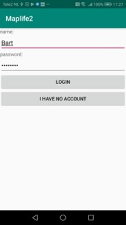
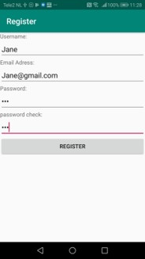
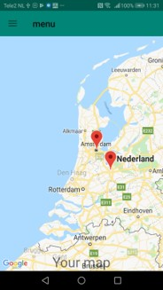
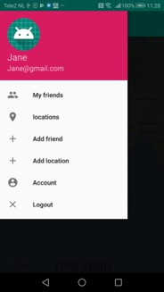
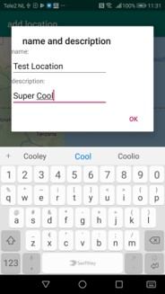
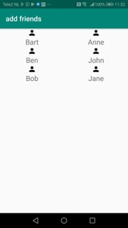
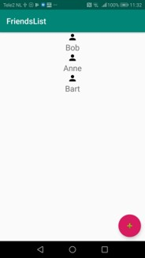
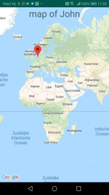
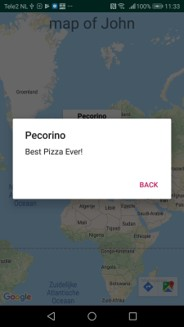

# Maplife2 by Bart-Jan Akerboom

Maplife is an app with which you can safe important places in your life, places you have been
on holiday or places you just want to remember for later. Every user has his/her own account 
and through making friendships on the app the map with places of other users can be viewed.
The philosophy of this app is to safe the best places in your life for yourself and 
your friends. The app uses a Rester Database to hold information and a google maps API to
show the places on the map. 

Demo video: asdfasdf

## sources

https://stackoverflow.com/

## License 

Copyright (c) 2019 Bart-Jan Akerboom

Permission is hereby granted to anyone obtaining this software to use, copy, modify
publish or distribute copies of it. 

The above copyright statement should be mentioned in all copies of the Software.
