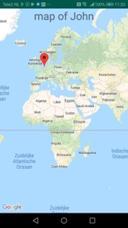
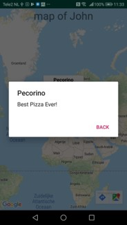

# Maplife2 final report

## description

Maplife is an app with which you can safe important places in your life, places you have been on holiday or places you just want to remember for later. Every user has his/her own account and through making friendships on the app the map with places of other users can be viewed. The philosophy of this app is to safe the best places in your life for yourself, if you want to revisit some day or to share them with your friends.

## technical design

## functionality by classes. 

### activities

#### Loginactivity
this activity verifies that the username typed in exists and the typedin password matches with the password of the user saved in the database. For this it calls the loginDataGetRequest. Upon succesfull login it starts up the mainActivity, the loggedIn ID is passed on to the new activity. If a new user starts the app, he can press the register button to get to the SigninActivity.

#### SigninActivity
this activity has editText fields in which the new user can type his register information. This information is send to the UserPostRequest, which uploads it in the database. Hereafter, IdGetRequestByEmail is called, to retreive the created ID of the new user. Upon succesfulll registration the mainActivity is started and the loggedIn ID is passed on.

#### StartActivity
This activity starts up when the app is initialized. It sends an intent to the mainactivity with a Boolean: loginChecker, to let this activity know that no user has logged In yet. The StartActivity has no layout.

#### MainActivity
This activity is the central activity of the app. It checks if a user is loggedin, and shows the locationsMap of the loggedinUser. The information necessary for the creation of this map is retreived with the help of the UserGetRequest. The activity has a drawerLayout, which has onclickItems to the FriendsViewActivity, LocationsViewActivity,  AddFriendsActivity, AddLocationActivity, AccountActivity and LoginActivity. 

#### FriendsViewActivity

#### LocationsViewActivity

#### AddFriendsActivity

#### AddLocationsActivity

#### AccountActivity

### helpers

### classes

## chalenges and changes between initial idea and final project

## final remarks
